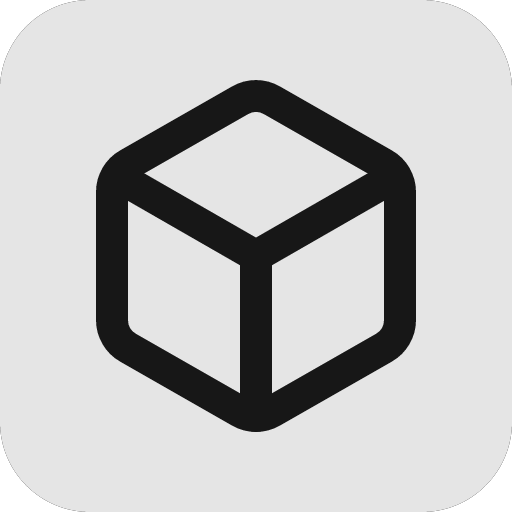
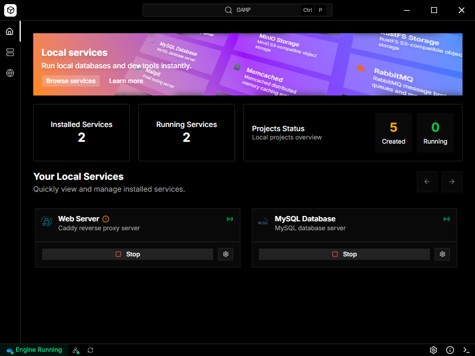
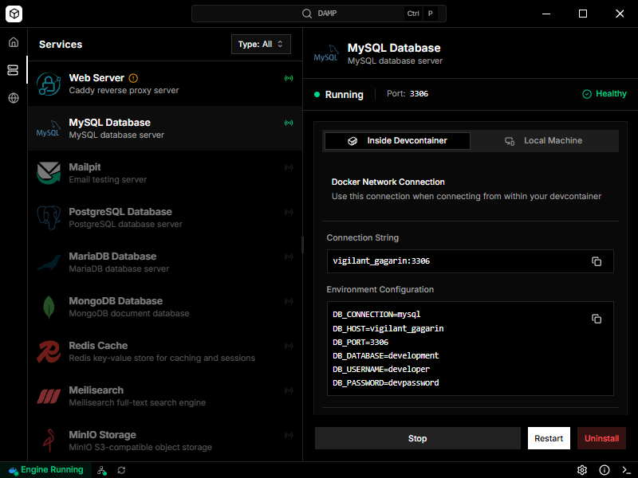
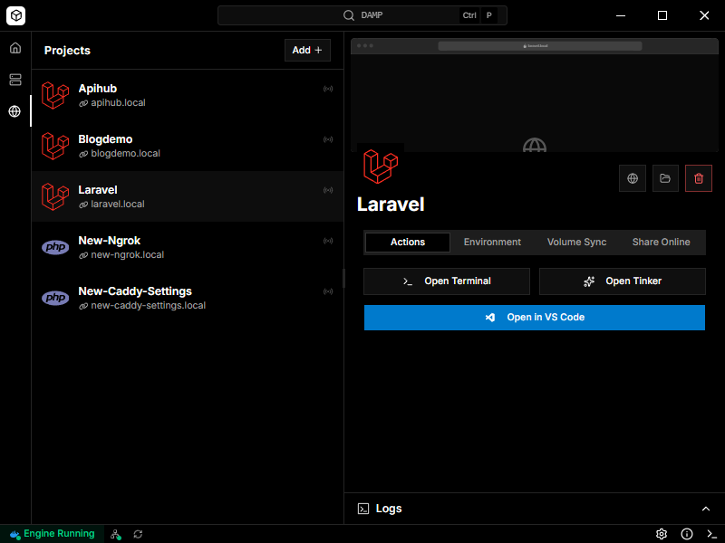

<div align="center">
  
  
  # DAMP
  
  **Docker-powered PHP development without the CLI complexity**
  
  [](https://github.com/PickleBoxer/damp-app/releases)
  [](https://github.com/PickleBoxer/damp-app/releases)
  
  [Download](https://github.com/PickleBoxer/damp-app/releases) · [Documentation](https://getdamp.app/) · [Report Bug](https://github.com/PickleBoxer/damp-app/issues) · [Request Feature](https://github.com/PickleBoxer/damp-app/issues)
</div>

---

## 📖 About

**DAMP** transforms Docker into a visual development environment for PHP developers. Create production-ready containerized projects, manage databases and services, and get automatic HTTPS domains—all without touching the terminal.

### ✨ Key Features

- 🚀 **One-Click Project Creation** — Laravel or PHP projects with DevContainers, Xdebug, and docker-compose pre-configured
- 🔒 **Automatic HTTPS** — Every project gets custom `.local` domains with SSL certificates via Caddy reverse proxy
- 🎛️ **14 Pre-Configured Services** — MySQL, PostgreSQL, MongoDB, Redis, Valkey, MariaDB, Memcached, Meilisearch, Typesense, Mailpit, MinIO, RabbitMQ, and Caddy
- 🌐 **Ngrok Integration** — Share localhost with clients or webhooks instantly using built-in tunnel management
- 📦 **Zero System Impact** — Run PHP 7.4, 8.0, 8.1, 8.2, 8.3, and 8.4 simultaneously without version conflicts
- 🔄 **Smart Volume Sync** — Bidirectional sync between Docker volumes and local filesystem with selective exclusions
- 🎨 **Beautiful UI** — Modern desktop interface built with React 19 and shadcn/ui
- 💻 **VS Code Ready** — Auto-generates DevContainers with IntelliSense and debugging configured

### 🎯 Who Is This For?

- PHP/Laravel developers tired of XAMPP version conflicts or Docker CLI complexity
- Freelancers managing multiple client projects with different requirements
- Teams needing reproducible development environments
- Developers wanting Docker's production-parity without memorizing terminal commands
- Anyone transitioning from Herd/Valet seeking containerization benefits

### 🆚 Why Choose DAMP?

| vs | Advantage |
|---|---|
| **Laravel Herd** | True Docker containers (production-parity), works with any PHP framework |
| **DDEV/Lando** | Beautiful GUI instead of CLI commands, visual configuration instead of YAML |
| **XAMPP/MAMP** | Complete isolation, multiple PHP versions, clean uninstall, reproducible environments |
| **Docker CLI** | Visual management, automatic reverse proxy, one-click setup, no command memorization |

---

## 🚀 Quick Start

### Installation

1. **Download** the latest release for Windows from [Releases](https://github.com/PickleBoxer/damp-app/releases)
2. **Install** by running the `.exe` installer or extract the portable `.zip`
3. **Launch** DAMP from your desktop or Start menu

### Prerequisites

- **Docker Desktop** (or Docker Engine) must be installed and running
- **VS Code** with [Dev Containers extension](https://marketplace.visualstudio.com/items?itemName=ms-vscode-remote.remote-containers) — Required to open generated DevContainer projects
- **Windows 10/11**

### Creating Your First Project

1. Click **"New Project"** in the DAMP dashboard
2. Choose **Laravel** or **Basic PHP** template
3. Configure PHP version, domain name, and database
4. Click **Create** — your project will be ready with HTTPS in seconds!

Visit [Documentation](https://getdamp.app/) for detailed guides.

---

## 📸 Screenshots

<div align="center">
  
  <p><i>Project Dashboard with real-time status monitoring</i></p>
  
  
  <p><i>Visual service management with one-click installation</i></p>
  
  
  <p><i>Multi-site management with custom domains</i></p>
</div>

---

## 🛠️ Tech Stack

Built with modern technologies for performance, security, and developer experience:

### Core Framework
- **[Electron 38](https://www.electronjs.org)** — Cross-platform desktop framework with context isolation
- **[Vite 7](https://vitejs.dev)** — Lightning-fast build tool and HMR
- **[TypeScript 5.9](https://www.typescriptlang.org)** — Type-safe development

### User Interface
- **[React 19](https://reactjs.org)** — UI library with React Compiler enabled
- **[TanStack Router](https://tanstack.com/router)** — Type-safe file-based routing with memory history
- **[shadcn/ui](https://ui.shadcn.com)** — Beautiful, accessible component system
- **[Tailwind CSS 4](https://tailwindcss.com)** — Utility-first styling
- **[Lucide Icons](https://lucide.dev)** — Modern icon library
- **[Geist Font](https://vercel.com/font)** — Clean, readable typography

### Backend Integration
- **[Dockerode](https://github.com/apocas/dockerode)** — Docker Engine API client
- **[TanStack Query](https://tanstack.com/query)** — Async state management
- **[Zod 4](https://zod.dev)** — Runtime validation and type safety

### DevOps & Infrastructure
- **[Caddy](https://caddyserver.com)** — Automatic HTTPS reverse proxy
- **[Ngrok](https://ngrok.com)** — Secure tunneling service
- **Docker** — Containerization engine

### Quality Assurance
- **[Vitest](https://vitest.dev)** — Unit testing framework
- **[Playwright](https://playwright.dev)** — End-to-end testing
- **[ESLint 9](https://eslint.org)** — Code linting
- **[Prettier](https://prettier.io)** — Code formatting

### Distribution
- **[Electron Forge](https://www.electronforge.io)** — Building, packaging, and publishing
- **GitHub Actions** — Automated CI/CD pipeline with R2 backup

---

## 💻 Development

```bash
# Clone and setup
git clone https://github.com/PickleBoxer/damp-app.git
cd damp-app
pnpm install

# Start development
pnpm start          # Development mode with HMR
pnpm test           # Run tests
pnpm lint           # Check code quality
```

See [Contributing Guide](CONTRIBUTING.md) for detailed development guidelines

---

## 🤝 Contributing

Contributions are welcome! Whether it's bug reports, feature requests, or code contributions.

### How to Contribute

1. **Fork** the repository
2. **Create** a feature branch (`git checkout -b feature/amazing-feature`)
3. **Commit** your changes using [Conventional Commits](https://www.conventionalcommits.org/)
   - `feat:` — New features
   - `fix:` — Bug fixes
   - `docs:` — Documentation updates
   - `refactor:` — Code refactoring
   - `test:` — Test additions or updates
4. **Push** to your branch (`git push origin feature/amazing-feature`)
5. **Open** a Pull Request

### Development Guidelines

- Follow existing code style (enforced by ESLint/Prettier)
- Write tests for new features
- Update documentation as needed
- Ensure all tests pass before submitting PR
- Keep commits atomic and well-described

See [CONTRIBUTING.md](CONTRIBUTING.md) for detailed guidelines.

---

## 📄 License

This project is licensed under the **MIT License** — see [LICENSE](LICENSE) file for details.

---

## 🙏 Acknowledgments

- [Electron](https://www.electronjs.org) — Cross-platform desktop framework
- [shadcn/ui](https://ui.shadcn.com) — Beautiful component library
- [Caddy](https://caddyserver.com) — Automatic HTTPS reverse proxy
- [Laravel Herd](https://herd.laravel.com) — Inspiration for simplifying local development

---

<div align="center">
  <p>Made with ❤️ for the PHP community</p>
  <p>
    <a href="https://github.com/PickleBoxer/damp-app">⭐ Star on GitHub</a> •
    <a href="https://github.com/PickleBoxer/damp-app/releases">📥 Download</a> •
    <a href="https://getdamp.app/">📚 Docs</a>
  </p>
</div>
